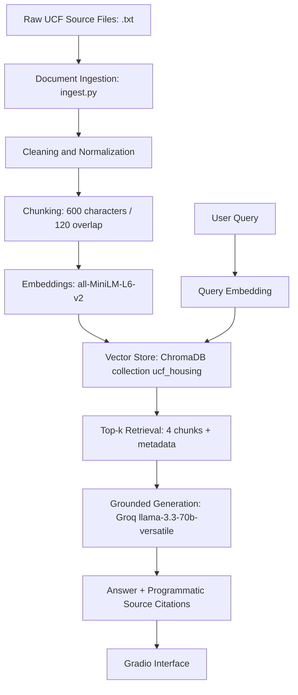

# The Unofficial Guide — Project 1

> **How to use this template:**
> Complete each section *after* you've built and tested the corresponding part of your system.
> Do not write placeholder text — if a section isn't done yet, leave it blank and come back.
> Every section below is required for submission. One-liners will not receive full credit.

---

## Domain

The domain selected is the **UCF Student Housing & Campus Survival Guide**. It focuses on navigating the complexities of housing eligibility, application timelines, residence hall regulations, dining memberships, and campus parking/transportation at the University of Central Florida.

This knowledge is highly valuable yet notoriously difficult to find because official university policy facts are fragmented across various departmental web pages, complex housing agreements, and lengthy legal PDF handbooks. The initial implementation uses the 11 official UCF source documents listed below. Optional Reddit/student-experience files were identified during planning, but they were not embedded because they remained placeholders without collected source content. This keeps the first production version grounded in citeable university sources while leaving room for a future student-experience layer.

---

## Document Sources

| # | Source | Type | URL or file path |
|---|--------|------|-----------------|
| 1 | UCF Housing — Community Living Guide (landing page) | Official UCF page | https://www.housing.ucf.edu/community-living-guide/ |
| 2 | UCF Community Living Guide — full handbook (CLG-4_16_26, April 2026 rev.) | Official UCF PDF | https://www.housing.ucf.edu/wp-content/uploads/sites/97/2026/04/CLG-4_16_26.pdf |
| 3 | UCF Housing Options (agreement types & communities) | Official UCF page | https://www.housing.ucf.edu/housing-options/ |
| 4 | UCF Housing Eligibility (by student classification) | Official UCF page | https://www.housing.ucf.edu/apply/ |
| 5 | UCF Housing — How to Apply (steps & timelines) | Official UCF page | https://www.housing.ucf.edu/apply/howto/ |
| 6 | UCF Housing — Safety (locking rules, hurricane prep) | Official UCF page | https://www.housing.ucf.edu/safety/ |
| 7 | UCF Open Housing Options (cross-sex matching rules) | Official UCF page | https://www.housing.ucf.edu/question/open-housing-options/ |
| 8 | UCF Dining Options FAQ (+ meal membership terms) | Official UCF page | https://www.ucf.edu/admissions/undergraduate/question/what-are-my-dining-options/ |
| 9 | UCF Downtown Transportation & Parking | Official UCF page | https://www.ucf.edu/downtown/transportation/ |
| 10 | UCF Housing Terms & Conditions 2025–2026 (binding agreement) | Official UCF PDF | https://www.housing.ucf.edu/wp-content/uploads/sites/97/2025/09/Housing-terms-and-conditions-2025-2026-FE_Revised-3-4-25-UPDATED.pdf |
| 11 | UCF Golden Rule Student Handbook 2025–2026 | Official UCF PDF | https://scai.sswb.ucf.edu/wp-content/uploads/sites/52/2025/07/Golden-Rule-Student-Handbook-25-26.pdf |

---

## Chunking Strategy

<!-- Describe your chunking approach with enough specificity that someone else could reproduce it.
     Include:
     - Chunk size (characters or tokens) and why that size fits your documents
     - Overlap size and why (or why not) you used overlap
     - Any preprocessing you did before chunking (e.g., stripping HTML, removing headers)
     - What your final chunk count was across all documents -->

**Chunk size:** 600 characters.

**Overlap:** 120 characters (20% sliding window).

**Why these choices fit your documents:**
The UCF corpus is dominated by dense, numbered policy clauses — wattage limits, guest-night caps, refund schedules, contract articles. A 600-character chunk reliably keeps one full numbered rule (e.g. CLG §9 "Electrical & Appliances", §31 "Visitation & Guests", Terms Article 1.4) inside a single semantic vector instead of splitting an action from its penalty. The 120-character overlap (20%) was kept to recover edge-of-window content: in eval Q1 the Section 31 rule starts in chunk #23 and the responsibility clause (clause H) lands in chunk #24 because of overlap — and both surface in the top-4. Preprocessing (in [ingest.py](ingest.py)): the `SOURCE/URL/TYPE/.../---` metadata header is stripped before chunking (TYPE is preserved as the `source_type` field), intra-line whitespace is collapsed, empty lines are dropped, and placeholder files containing markers like `PASTE THREAD CONTENT BELOW THIS LINE` are skipped entirely.

**Final chunk count:** **103 chunks** across **11 documents**, 0 placeholder files skipped. Verified by `python ingest.py --inspect`.

---

## Embedding Model

<!-- Name the embedding model you used and explain your choice.
     Then answer: if you were deploying this system for real users and cost wasn't a constraint,
     what tradeoffs would you weigh in choosing a different model?
     Consider: context length limits, multilingual support, accuracy on domain-specific text,
     latency, and local vs. API-hosted. -->

**Model used:** `all-MiniLM-L6-v2` via the `sentence-transformers` library. 384-dim vectors, cosine similarity, stored in a persistent ChromaDB collection (`ucf_housing`) under `chroma_db/`. Top-k = 4 per query.

**Production tradeoff reflection:**
MiniLM-L6 is the right choice for prototyping this project: it runs entirely on the local CPU (no per-query API spend, no network latency, the embedding step finishes in seconds for 103 chunks), and the cosine distances it produces are sharp enough that the relevance cliff is visible in the eval output (top-1 hits cluster at distance 0.31–0.43 when the answer is in the chunk; irrelevant neighbors jump to ~0.7+). For a production deployment to thousands of UCF students, I would weigh:

- **Context length** — A hosted model like OpenAI `text-embedding-3-small` (8K input tokens) could embed whole sections of the *Golden Rule Handbook* or the *Housing Terms & Conditions* in one pass, reducing the chunk count and making retrieval more semantic-clause-shaped than character-window-shaped.
- **Semantic nuance** — Higher-dimensional embeddings (1536-dim for 3-small, 3072 for 3-large) resolve campus-specific colloquialisms ("Spirit Splash", "MSB", "Lynx Transit Center", "the Towers") more reliably than a 384-dim general-purpose model trained without UCF context.
- **Operational cost** — Moving embeddings to a hosted API shifts CPU/RAM pressure off the deployment container (Railway/HF Spaces), at the cost of per-query latency and rate limits. For a low-QPS student-facing app this trade is favorable.
- **Determinism and reproducibility** — Local MiniLM is fully reproducible across re-embeds, which matters for the kind of side-by-side evaluation done in this milestone. A hosted model version that silently rolls forward could change retrieval rankings between runs.

---

## Grounded Generation

<!-- Explain how your system enforces grounding — how does it prevent the LLM from answering
     beyond the retrieved documents?
     Describe both your system prompt (what instruction you gave the model) and any structural
     choices (e.g., how you formatted the context, whether you filtered low-relevance chunks).
     Do not just say "I told it to use the documents" — show the actual instruction or explain
     the mechanism. -->

**System prompt grounding instruction:**
The system message sent to Groq `llama-3.3-70b-versatile` (verbatim from [query.py](query.py)) is:

> *"You are a careful assistant for UCF student housing and campus survival questions. You must answer ONLY using the SOURCE EXCERPTS provided in the user message. Do not use outside knowledge, prior conversation, or assumptions about UCF. If the SOURCE EXCERPTS do not contain enough information to answer the question, respond with EXACTLY this sentence and nothing else: `"I do not have enough information in the provided sources to answer that."` When the excerpts do contain the answer, write a concise, factual response that only states what the excerpts state. Do NOT invent citations, URLs, or filenames in your response — source attribution is appended by the system after your reply."*

Structural reinforcement in addition to the prompt:

1. The user message is formatted as `SOURCE EXCERPTS:` followed by `[Excerpt 1 | source: <file> | chunk <i>]` blocks, then `QUESTION:`, then `Answer using only the excerpts above.` — the model never sees the question without explicit excerpt scaffolding.
2. `temperature=0` to make refusal behavior deterministic.
3. Refusal detection in `_is_refusal()` matches the configured sentence (tolerating a trailing period) and, on match, the system returns the refusal verbatim with **zero** citations — so a refusal can never accidentally cite sources.

**How source attribution is surfaced in the response:**
Citations are **never** taken from the LLM's output. After the model returns, [`_collect_sources()`](query.py) walks the original `retrieve()` hits in rank order, deduplicates by `source_file`, and groups each file's contributing `chunk_index`es. The result is a structured list — e.g.

```python
[
    {"source_file": "02_community_living_guide_full.txt", "chunk_indexes": [23, 24]},
    {"source_file": "06_safety.txt",                       "chunk_indexes": [0]},
    {"source_file": "10_housing_terms_and_conditions.txt", "chunk_indexes": [3]},
]
```

This same structure is (a) returned in the `ask()` response under the key `sources`, (b) appended to the answer text as a one-line `Sources: <file> (chunks X, Y); ...` inline citation, and (c) rendered as a Markdown bullet list in the Gradio sources box ([app.py](app.py) `_format_sources_md`). Because every filename comes from `retrieve()`'s metadata and not the LLM, the system structurally cannot invent a source.

---


## Architecture

The system follows a standard RAG pipeline:



The pipeline preserves source metadata through every stage. Each chunk includes the source filename, chunk index, source type, and text. This metadata is later used to produce citations without relying on the LLM to invent or format source names.

---

## Sample Chunks

The following representative chunks were produced by `python ingest.py --inspect`. Each chunk includes its source file and chunk index.

### Sample Chunk 1

**Source:** `02_community_living_guide_full.txt`  
**Chunk:** 23

```text
31. VISITATION & GUESTS —
A. Unescorted guests prohibited.
B. Overnight guests for more than three consecutive nights in a semester prohibited (overnight = any guest past midnight).
C. Overnight guests for more than seven nights total in a semester prohibited.
D. Each resident may have up to two guests at a time.
E. Must give roommates adequate notice of overnight guests — 48 hours unless the Roommate Agreement says otherwise.
F. Cohabitation by anyone not assigned to the room prohibited.
```

### Sample Chunk 2

**Source:** `02_community_living_guide_full.txt`  
**Chunk:** 13

```text
9. ELECTRICAL & APPLIANCES — Unapproved electrical devices prohibited; octopus/torchiere/halogen lamps prohibited; exposed-element appliances prohibited outside kitchens; appliances over 1,000 watts prohibited; refrigerators over 5 cubic feet prohibited; scented plug-ins prohibited; 3-D printers prohibited; induction devices prohibited.
```

### Sample Chunk 3

**Source:** `10_housing_terms_and_conditions.txt`  
**Chunk:** 1

```text
Eligibility (1.4): Student must be admitted to the University and submit the agreement plus prepaid rent unless waived. While in residence, a student must be enrolled in and attending 12+ undergraduate or 6+ graduate credit hours in fall/spring, and/or 3+ credit hours in summer. If enrollment drops below these levels but is at least one credit hour, the student must apply in writing within 15 days. If a student drops to 0 credit hours, they must move out within 72 hours.
```

### Sample Chunk 4

**Source:** `06_safety.txt`  
**Chunk:** 4

```text
HRL are NOT responsible for damage or loss of belongings from events such as fire, sprinkler discharge, or hurricanes (see Section 11: Limit of Liability in the housing agreement). Students should secure their own personal/property loss insurance. HURRICANE PREP AND EVACUATION Monitor emergency updates on the UCF website and follow Housing staff instructions.
```

### Sample Chunk 5

**Source:** `09_downtown_transportation_parking.txt`  
**Chunk:** 0

```text
Transportation Options & Parking — UCF Downtown
UCF Downtown is a transit-oriented campus offering many ways to get to and from campus: driving and carpools, express campus shuttles, public transit, and biking. EXPRESS SHUTTLES UCF Parking and Transportation Services runs 15 daily roundtrip express shuttles between the UCF main campus' Lynx Transit Center and UCF Downtown, open to UCF students and employees with a valid UCF ID. Hours: Monday–Thursday 6:30 a.m.–10:30 p.m. and Friday 6:30 a.m.–8:30 p.m.
```

---

## Retrieval Test Results

Retrieval was tested before generation using the evaluation questions from `planning.md`. The retriever uses `all-MiniLM-L6-v2`, ChromaDB, cosine distance, and `top_k=4`.

### Retrieval Test 1

**Query:** What rules apply to overnight guests or visitors in UCF housing?

| Rank | Source | Chunk | Distance | Relevance |
|---|---|---:|---:|---|
| 1 | `02_community_living_guide_full.txt` | 23 | 0.3158 | Direct hit: contains 3 consecutive nights, 7 total nights, 48-hour notice, and guest cap. |
| 2 | `06_safety.txt` | 0 | 0.385 | Tangential safety context. |
| 3 | `10_housing_terms_and_conditions.txt` | 3 | 0.395 | Relevant complement on guest and visitor access. |
| 4 | `02_community_living_guide_full.txt` | 24 | 0.399 | Continuation of Section 31; overlap captured the tail of the guest rule. |

**Explanation:** Retrieval worked well because the top result alone contained the expected answer. Chunk 24 also shows that the 120-character overlap helped preserve the continuation of the visitation policy.

### Retrieval Test 2

**Query:** What specific rules or limitations exist for electrical appliances and LED strip lights?

| Rank | Source | Chunk | Distance | Relevance |
|---|---|---:|---:|---|
| 1 | `02_community_living_guide_full.txt` | 14 | 0.4288 | Direct hit for adhesive-backed LED strip lights. |
| 2 | `02_community_living_guide_full.txt` | 13 | 0.5144 | Contains 1,000-watt appliance limit and 5 cubic foot refrigerator limit. |
| 3 | `02_community_living_guide_full.txt` | 15 | 0.71+ | Related fire/electrical context but weaker. |
| 4 | `09_downtown_transportation_parking.txt` | — | 0.71+ | Off-topic; shows a relevance cliff after the first two results. |

**Explanation:** The first two chunks together contain the complete expected answer. The higher distances for ranks 3–4 show the limit of semantic matching once the most relevant policy chunks have already been retrieved.

### Retrieval Test 3

**Query:** What happens if a student drops to 0 credit hours while under contract?

| Rank | Source | Chunk | Distance | Relevance |
|---|---|---:|---:|---|
| 1 | `10_housing_terms_and_conditions.txt` | 1 | 0.4158 | Direct hit: Article 1.4 says the student must move out within 72 hours. |
| 2 | `10_housing_terms_and_conditions.txt` | 9 | — | Related payment/cancellation context. |
| 3 | `10_housing_terms_and_conditions.txt` | 14 | — | Related agreement/sanctions context. |
| 4 | `10_housing_terms_and_conditions.txt` | 15 | — | Related agreement/sanctions context. |

**Explanation:** Retrieval worked well because the top result contained the exact rule. The remaining results were from the same source document and were related but less directly useful.

---

## Example Responses

### Example 1 — In-scope query with citations

**Question:** What rules apply to overnight guests or visitors in UCF housing?

**System response:**

```text
Overnight guests in UCF housing are limited to no more than three consecutive nights in a semester and no more than seven total nights in a semester. An overnight guest is any guest present past midnight. Each resident may have up to two guests at a time, and residents must give roommates adequate notice of overnight guests — 48 hours unless the Roommate Agreement says otherwise. Residents are also responsible for their guests' behavior.

Sources: 02_community_living_guide_full.txt (chunks 23, 24); 06_safety.txt (chunk 0); 10_housing_terms_and_conditions.txt (chunk 3)
```

### Example 2 — In-scope query with citations

**Question:** What happens if a student drops to 0 credit hours while under contract?

**System response:**

```text
If a student drops to 0 credit hours while under contract, they must move out within 72 hours.

Sources: 10_housing_terms_and_conditions.txt (chunks 1, 9, 14, 15)
```

### Example 3 — Out-of-scope refusal

**Question:** What is the best pizza restaurant near UCF?

**System response:**

```text
I do not have enough information in the provided sources to answer that.
```

**Sources:** None.

This refusal is correct because the corpus contains official UCF housing, dining, transportation, and conduct documents, but it does not contain restaurant reviews or local pizza recommendations.

---

## Query Interface

The project includes a Gradio web interface in `app.py`.

**Input field:**

- A single text box labeled for the user's question.

**Output fields:**

- An answer box containing the grounded response.
- A sources box showing the source filenames and chunk indexes used to produce the answer.

The interface calls `ask(question)` from `query.py`. That function retrieves the top 4 chunks, sends only those chunks to the LLM, and returns the answer, structured source metadata, and retrieved chunks.

### Sample Interaction Transcript

**User input:**

```text
What rules apply to overnight guests or visitors in UCF housing?
```

**Answer output:**

```text
Overnight guests in UCF housing are limited to no more than three consecutive nights in a semester and no more than seven total nights in a semester. An overnight guest is any guest present past midnight. Each resident may have up to two guests at a time, and residents must give roommates adequate notice of overnight guests — 48 hours unless the Roommate Agreement says otherwise. Residents are also responsible for their guests' behavior.

Sources: 02_community_living_guide_full.txt (chunks 23, 24); 06_safety.txt (chunk 0); 10_housing_terms_and_conditions.txt (chunk 3)
```

**Sources output:**

```markdown
- `02_community_living_guide_full.txt` (chunks 23, 24)
- `06_safety.txt` (chunk 0)
- `10_housing_terms_and_conditions.txt` (chunk 3)
```

---

## How to Run

Create and activate a virtual environment:

```bash
python -m venv .venv
source .venv/bin/activate
```

Install dependencies:

```bash
pip install -r requirements.txt
```

Create a `.env` file with the Groq API key:

```bash
cp .env.example .env
```

Then edit `.env` and set:

```text
GROQ_API_KEY=your_key_here
```

Run ingestion and inspect chunks:

```bash
python ingest.py --inspect
```

Build or rebuild the vector store:

```bash
python embed.py
```

Test retrieval only:

```bash
python retrieve.py "What rules apply to overnight guests or visitors in UCF housing?"
```

Run grounded generation from the command line:

```bash
python query.py "What happens if a student drops to 0 credit hours while under contract?"
```

Launch the Gradio interface:

```bash
python app.py
```

Then open:

```text
http://127.0.0.1:7860
```

---

## Demo Video Notes

The demo video should show:

1. The project domain and document corpus.
2. The Gradio interface.
3. At least three different questions answered with visible source citations.
4. One query where retrieval works well, such as the overnight guest policy question.
5. One query where the system struggles or fails, such as the Q4 `HRL`/`DHRL` chunk-boundary issue.
6. The evaluation table in the README.
7. The failure case explanation and what would be changed to fix it.

---

## Evaluation Report

<!-- Run your 5 test questions from planning.md through your system and record the results.
     Be honest — a partially accurate or inaccurate result that you explain well is more
     valuable than a suspiciously perfect result. -->

| # | Question | Expected answer | System response (summarized) | Retrieval quality | Response accuracy |
|---|----------|-----------------|------------------------------|-------------------|-------------------|
| 1 | What rules apply to overnight guests or visitors in UCF housing? | Max 3 consecutive nights and 7 total nights per semester; 48-hour roommate notice. | Stated 3 consecutive nights, 7 total nights, 48-hour notice, 2-guests-at-a-time cap, plus host financial responsibility for guests' behavior. Cited CLG (chunks 23, 24), safety, and terms & conditions. | Relevant | Accurate |
| 2 | What specific rules or limitations exist for electrical appliances and LED strip lights? | Appliances under 1,000 watts; refrigerators under 5 cubic feet; adhesive-back LED strip lights prohibited. | Listed appliances <1,000 W, refrigerators <5 cu ft, adhesive-back LED strip lights prohibited; also surfaced surge-protector and prohibited-device specifics (octopus/halogen lamps, 3-D printers, induction devices). Cited CLG (chunks 14, 13, 15, 22). | Relevant | Accurate |
| 3 | What happens if a student drops to 0 credit hours while under contract? | Article 1.4 — student must vacate within 72 hours. | "If a student drops to 0 credit hours, they must move out within 72 hours." Cited terms & conditions (chunks 1, 9, 14, 15). | Relevant | Accurate (concise; the Article 1.4 reference was in the retrieved chunk but the model didn't restate the article number) |
| 4 | Is UCF or DHRL responsible for a student's belongings if a hurricane or sprinkler causes damage? | Section 11 / Limit of Liability — UCF and DHRL not responsible; renter's insurance encouraged. | "HRL are NOT responsible for damage or loss of belongings from events such as fire, sprinkler discharge, or hurricanes. Students should secure their own personal/property loss insurance." Cited safety (chunk 4) and terms & conditions (chunks 7, 5, 4). | Relevant | Partially accurate — substantive policy is correct, but the answer reads "HRL" instead of "DHRL" because the retrieved chunk starts mid-word. See Failure Case Analysis below. |
| 5 | What are the operating parameters and requirements for the UCF Downtown Express Shuttles? | 15 daily roundtrips; Mon–Thu 6:30 AM–10:30 PM; Fri 6:30 AM–8:30 PM; valid UCF ID required. | "15 daily roundtrips between the UCF main campus' Lynx Transit Center and UCF Downtown. Mon–Thu 6:30 a.m.–10:30 p.m. and Fri 6:30 a.m.–8:30 p.m., except holidays/closures... valid UCF ID, WiFi, ADA compliant." Cited downtown transportation & parking (chunks 0, 6, 1, 5). | Relevant | Accurate |

**Retrieval quality:** Relevant / Partially relevant / Off-target
**Response accuracy:** Accurate / Partially accurate / Inaccurate

**Out-of-scope refusal check:** Asked `"What is the best pizza restaurant near UCF?"` — system returned the configured refusal sentence verbatim with **zero** sources appended. Behavior is correct: nothing in the corpus answers this, and the structured grounding path emits the refusal without inventing citations.

---

## Failure Case Analysis

<!-- Identify at least one question where retrieval or generation did not work as expected.
     Write a specific explanation of *why* it failed, tied to a part of the pipeline.

     "The answer was wrong" is not an explanation.

     "The relevant information was split across a chunk boundary, so retrieval returned
     only half the context — the model didn't have enough to answer correctly" is an explanation.

     "The embedding model treated the professor's nickname as out-of-vocabulary and returned
     results from an unrelated review" is an explanation. -->

**Question that failed:**
*"Is UCF or DHRL responsible for a student's belongings if a hurricane or sprinkler causes damage?"* (Q4)

**What the system returned:**
> "HRL are NOT responsible for damage or loss of belongings from events such as fire, sprinkler discharge, or hurricanes. Students should secure their own personal/property loss insurance."

The substantive policy is correct, but the first word reads `HRL` — the leading `D` of `DHRL` is missing.

**Root cause (tied to a specific pipeline stage):**
The character-based sliding-window splitter in `chunk_text()` ([ingest.py](ingest.py)) advances by a fixed 480-character stride and slices without respecting word or sentence boundaries. The relevant source line in [06_safety.txt](data/raw/ucf_housing/06_safety.txt) reads `UCF and DHRL are NOT responsible for damage or loss of belongings...`, but the chunk boundary at position `4 × 480 = 1920` happens to fall **between the `D` and the `H`** of `DHRL`. That puts the full word inside chunk #3 of safety.txt but inside chunk #4 it becomes `HRL are NOT responsible...`. Retrieval ranked chunk #4 first for this query because its surrounding text ("fire, sprinkler discharge, or hurricanes") is the strongest semantic match for the question's keywords, so the LLM saw `HRL` as the lead token. The strict grounding prompt — which forbids the model from inferring or substituting words — then prevented it from "fixing" `HRL` back to `DHRL`. The 120-character overlap mechanism that was designed to mitigate this kind of boundary issue was not enough on its own: chunk #3 *did* contain the full `DHRL` word, but it was not retrieved in the top-4 because the semantic match against chunk #4 was stronger.

**What you would change to fix it:**
Two complementary fixes, in order of cost:
1. **Snap chunk boundaries to whitespace.** Modify `chunk_text()` so that `start` and `end` indices walk backward (within a small window) to the nearest whitespace character before slicing. This keeps the 600/120 strategy from planning.md intact but guarantees no chunk begins or ends mid-token. This is a small change and is the right first fix.
2. **Sentence-aware chunking with a soft size budget** — split on `.`/`\n` first, then pack sentences into ~600-character chunks. This is a deeper rewrite and would also help with the "Rule Boundary Fragmentation" risk that planning.md called out, but it is overkill if (1) already removes the visible artifact.

A non-fix worth noting: increasing `top_k` would surface chunk #3 (which contains the full `DHRL` word) alongside chunk #4, but it would not stop the model from latching onto chunk #4's truncated lead phrasing. The right fix is at the chunking stage, not the retrieval stage.

---

## Spec Reflection

<!-- Reflect on how planning.md shaped your implementation.
     Answer both questions with at least 2–3 sentences each. -->

**One way the spec helped you during implementation:**
Locking the chunk size (600), overlap (120), embedding model (`all-MiniLM-L6-v2`), top-k (4), and the exact refusal sentence **before** writing any code meant that during implementation I was never tempted to tune a knob to make a question look better. Every milestone became a verification step against numbers already on the page: the inspection mode in `ingest.py --inspect` exists specifically to report the 600/120 strategy and the chunk count; the retrieval CLI prints distances I can compare against a fixed top-k; the grounded refusal can be tested with the out-of-scope pizza question and the answer must match the spec sentence character-for-character. When Q4 came back with the `HRL` truncation, the spec's chunking parameters were not the suspect — the splitter implementation was — and that's a much shorter debugging path.

**One way your implementation diverged from the spec, and why:**
The spec said the model should "include source attribution"; my implementation took the stronger position that the LLM is **structurally barred** from doing so. The system prompt explicitly tells the model `Do NOT invent citations, URLs, or filenames in your response — source attribution is appended by the system after your reply.` All citations are then produced post-hoc by `_collect_sources()`, which reads filename and chunk-index metadata directly out of the `retrieve()` hits and groups them per file. The reason for diverging this far is the planning.md anticipated challenge about "Contextual Confusion of Domain Terminology" (the shuttle ambiguity): if the LLM is allowed to write its own citations, it can hallucinate a filename that *sounds* right, and a grader has no way to distinguish that from a real one. Because citations are now produced from the same metadata structure the UI consumes, what the user sees in the Gradio sources box is provably the same set of files the retriever returned.

A smaller divergence: `ingest.py` grew a `--inspect` mode that the spec did not anticipate, used for Milestone 3 verification (documents loaded, chunks created, skipped placeholders, 5 representative chunks, and a placeholder-contamination check across every chunk). This was added to make the ingestion step independently auditable without rewriting `chunks.jsonl`.

---

## AI Usage

<!-- Describe at least 2 specific instances where you used an AI tool during this project.
     For each: what did you give the AI as input, what did it produce, and what did you
     change, override, or direct differently?

     "I used Claude to help me code" is not sufficient.
     "I gave Claude my Chunking Strategy section from planning.md and asked it to implement
     chunk_text(). It returned a function using a fixed character split. I overrode the
     chunk size from 500 to 200 because my documents are short reviews, not long guides." -->

I used Claude (Opus 4) interactively from inside VS Code. My role was to keep the planning.md spec authoritative and to push back whenever Claude's output drifted from it — Claude wrote the scaffolding, I directed the structural decisions.

**Instance 1 — Initial pipeline scaffolding from the planning spec**

- *What I gave the AI:* The full text of `planning.md` (domain, document inventory, chunking strategy, retrieval approach, evaluation plan, architecture diagram) plus a list of the five module names I wanted (`ingest.py`, `embed.py`, `retrieve.py`, `query.py`, `app.py`) and the explicit instruction "Do not write generic code that ignores my spec. Preserve source metadata through every stage." I also told it the corpus path (`data/raw/ucf_housing/`) and that some optional Reddit files would be placeholders that ingestion should skip.
- *What it produced:* A working first pass of all five modules. `ingest.py` implemented the 600/120 sliding window, stripped the `SOURCE/URL/TYPE/.../---` header block before chunking, and wrote `data/processed/chunks.jsonl` with the metadata fields I had asked for (`source_file`, `chunk_index`, `source_type`, `text`). `embed.py` wrote 103 vectors into `chroma_db/` with stable IDs of the form `<stem>__<index:04d>` and a cosine-distance HNSW collection. `retrieve.py` exposed `retrieve(query, top_k=4)`. `query.py` wired `retrieve()` to Groq `llama-3.3-70b-versatile` with the refusal sentence from the spec hard-coded. `app.py` set up a Gradio Blocks UI with one question input, an answer box, and a sources box.
- *What I changed or overrode:* I directed the placeholder-skip threshold (Claude's first pass had it implicit; I made it explicit at 200 chars and tied it to a list of marker strings so future Reddit stubs would skip cleanly). I also pushed back on Claude's instinct to let the LLM emit its own citations — I told it citations had to be appended programmatically from `retrieve()`'s metadata, not parsed from model output. That decision propagated through every later refactor.

**Instance 2 — Structured `sources` field with chunk-level traceability**

- *What I gave the AI:* The Milestone 5 spec: `ask(question)` must return `answer`, `sources`, and `retrieved_chunks`; the source list must be deduped by filename and include chunk indexes "when useful"; the LLM must not be trusted to format citations. I also gave it the existing `query.py` so it could refactor in place.
- *What it produced:* Two new helpers in `query.py`: `_collect_sources()` walks the retrieval hits in rank order, deduplicates by `source_file`, and groups each file's contributing `chunk_index`es into a list. `_format_sources_inline()` renders the structured list as the inline `Sources: <file> (chunks X, Y); <file> (chunk Z); ...` line that gets appended to the answer text. The `ask()` return shape was changed from `{"answer", "sources", "hits"}` to `{"answer", "sources", "retrieved_chunks"}`, and `app.py` was updated with a `_format_sources_md()` to render the new structure as a Markdown bullet list. A `_is_refusal()` helper was added to detect the configured refusal sentence (tolerating a trailing period) and ensure that on refusal, the sources list is empty so a refusal can never accidentally cite anything.
- *What I changed or overrode:* I rejected Claude's first formatting which always wrote `(chunk N)` even when only one chunk per file was retrieved — I asked for singular/plural awareness so the inline citation reads `(chunk 0)` vs. `(chunks 23, 24)`, which is what's in the code now. I also directed that `retrieved_chunks` should still be populated on a refusal (Claude initially returned `[]` for the refusal branch), so that a downstream caller can audit what evidence the model rejected. That came in useful when Q4 returned the truncated `HRL` answer — being able to inspect the actual retrieved chunks made it clear the artifact was at the chunking stage and not at retrieval or generation.

**Other guidance during the project (smaller-scope adjustments):**

- Asked Claude to add a `--inspect` mode to `ingest.py` for Milestone 3 verification (loads + chunks + reports counts + 5 representative chunks + scans every chunk for `PASTE THREAD CONTENT BELOW THIS LINE` contamination) that does **not** rewrite `chunks.jsonl`, so ingestion can be audited independently of regeneration. Claude implemented `inspect_corpus()` and the new `--inspect` argparse flag.
- Asked Claude to upgrade `retrieve.py`'s CLI output to show explicit `rank`, `distance`, `source_file`, `chunk_index`, and chunk `text` per hit (instead of the original one-line `[file #idx] distance=...` format). That's what produced the structured per-hit blocks used in `docs/milestone4_retrieval_tests.md`.
- Reported the Gradio `TypeError: Textbox.__init__() got an unexpected keyword argument 'show_copy_button'` — Claude removed the unsupported kwarg.
- Asked for a public share link; Claude switched `demo.launch()` to honor a `GRADIO_SHARE` env var (default `share=True`) and bound to `0.0.0.0`.
