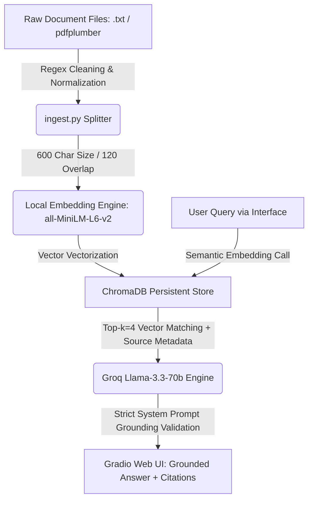

# Project 1 Planning: The Unofficial Guide

> Write this document before you write any pipeline code.
> Your spec and architecture diagram are what you'll use to direct AI tools (Claude, Copilot, etc.) to generate your implementation — the more specific they are, the more useful the generated code will be.
> Update the Retrieval Approach and Chunking Strategy sections if you change your approach during implementation.
> Update this file before starting any stretch features.

---

## Domain

The domain selected is the **University of Central Florida (UCF) Student Housing & Campus Survival Guide**. It focuses on navigating the complexities of housing eligibility, application timelines, residence hall regulations, dining memberships, and campus parking/transportation at the University of Central Florida.

This knowledge is highly valuable yet notoriously difficult to find because official university policy facts are fragmented across various departmental web pages, complex housing agreements, and lengthy legal PDF handbooks. Conversely, student perspectives are scattered across unverified, unstructured Reddit threads. This system bridges that gap by centralizing official rules alongside real-world student context while maintaining strict programmatic grounding to separate legal facts from casual observations.

---

## Documents

I collected a UCF housing and campus survival corpus focused on official housing policy, residence life rules, dining, transportation, parking, and student conduct.

Official collected sources in ./Documents folder:
1. `01_community_living_guide_page.txt` — UCF Housing: Community Living Guide landing page
2. `02_community_living_guide_full.txt` — UCF Community Living Guide full text PDF (April 2026 Revision)
3. `03_housing_options.txt` — UCF Housing Options (Agreement configurations)
4. `04_housing_eligibility.txt` — UCF Housing Eligibility by student classification
5. `05_how_to_apply.txt` — UCF Housing How to Apply (Timelines and steps)
6. `06_safety.txt` — UCF Housing Safety, core locking rules, and hurricane procedures
7. `07_open_housing.txt` — UCF Open Housing Options and cross-sex room matching rules
8. `08_dining_options.txt` — UCF Dining Options FAQ and explicit meal membership terms
9. `09_downtown_transportation_parking.txt` — UCF Downtown Transportation and Parking parameters
10. `10_housing_terms_and_conditions.txt` — UCF Housing Terms and Conditions 2025–2026 legally binding contract
11. `11_golden_rule_handbook.txt` — UCF Golden Rule Student Handbook 2025–2026

> Note: Student-generated (Reddit) sources are planned as an optional second layer and have not been collected yet. They will be added to this list once gathered and will be tagged as anecdotal to keep them distinct from official policy.

---

## Chunking Strategy

**Chunk size:** 600 characters.

**Overlap:** 120 characters (20% sliding window).

**Reasoning:** Our document corpus contains dense, highly specific legal conditions, fine schedules, and compliance policies (such as exact wattage limits or guest night caps). A 600-character chunk size ensures that individual rules are captured in their entirety within a single semantic vector without being broken up or diluted by surrounding unrelated sections. The 120-character overlap provides a safety window, ensuring that critical search terms located near the edges of a text slice—such as an apartment name or specific clause number—remain retrievable.

---

## Retrieval Approach

**Embedding model:** `all-MiniLM-L6-v2` via the `sentence-transformers` library.

**Top-k:** 4 chunks per query.

**Production tradeoff reflection:**
The `all-MiniLM-L6-v2` model is ideal for prototyping because it runs entirely locally without incurring API token costs or network latency. However, if we scaled this application to thousands of real users in a production setting, we would consider a paid cloud API model like OpenAI's `text-embedding-3-small`. The tradeoffs considered include:
* **Context Length:** A production API model handles significantly larger token limits, allowing us to embed entire sections of the *Golden Rule* at once rather than short character segments.
* **Semantic Nuance:** Premium models offer higher vector dimensionality, which improves search accuracy when students use colloquial campus slang (e.g., "Spirit Splash" or "MSB Men's Room") that local open-source models might struggle to resolve semantically.
* **Compute Overhead:** Shifting embeddings to an external API lowers the local memory and CPU/GPU usage requirements on our production container host (Railway).

---

## Evaluation Plan

| # | Question | Expected answer |
|---|----------|-----------------|
| 1 | What rules apply to overnight guests or visitors in UCF housing? | Must cite that overnight guests (past midnight) are limited to a max of 3 consecutive nights and 7 total nights per semester, with a 48-hour notice required for roommates. |
| 2 | What specific rules or limitations exist for electrical appliances and LED strip lights? | Must state that appliances must be under 1,000 watts, refrigerators under 5 cubic feet, and adhesive-backed LED strip lights are strictly prohibited. |
| 3 | What happens if a student drops to 0 credit hours while under contract? | Traces to Article 1.4: the student loses housing eligibility completely and must vacate the residential space within 72 hours. |
| 4 | Is UCF or DHRL responsible for a student's belongings if a hurricane or sprinkler causes damage? | Traces to Safety/Terms Section 11: UCF/DHRL carries no liability for personal property loss; students are strongly encouraged to secure independent renter's insurance. |
| 5 | What are the operating parameters and requirements for the UCF Downtown Express Shuttles? | Must extract that there are 15 daily roundtrips operating Monday–Thursday (6:30 AM–10:30 PM) and Friday (6:30 AM–8:30 PM) requiring a valid UCF ID. |

---

## Anticipated Challenges

1. **Rule Boundary Fragmentation:** Because official policy clauses (such as complex contract cancellation schedules) span multiple dense sentences, rigid character-based splitting could sever an action from its penalty or context. This risk is addressed by utilizing a 20% chunk overlap.
2. **Contextual Confusion of Domain Terminology:** The word "shuttle" appears in both main campus housing contexts and downtown transit documents. The retrieval model could face off-topic retrieval challenges by returning downtown shuttle details when a student asks about main campus grocery shopping. We will mitigate this by passing source metadata filenames back to the system interface.

---

## AI Tool Plan

> . For each pipeline stage where you'll use an AI tool, state: (a) which tool, (b) exactly what you'll give it as input — which sections of THIS planning.md and which requirements from the instructions, and (c) what you expect it to produce. Be specific. Example of the level of detail expected: "I'll prompt Claude with my Chunking Strategy section plus the file headers and ask it to implement chunk_text() at 600/120 that attaches source and category metadata to each chunk."

- **Ingestion & Chunking:**
- **Embedding + Vector Store:**
- **Retrieval:**
- **Generation & Grounding:**
- **Interface (Gradio):**

---

## Architecture

