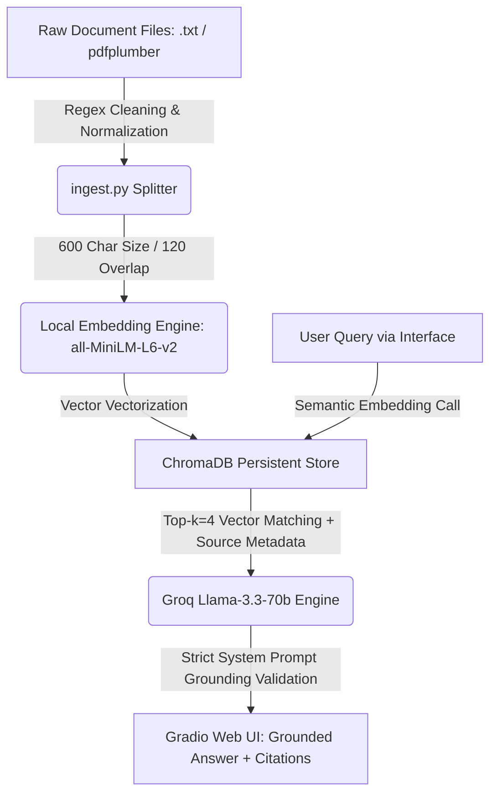

# Project 1 Planning: The Unofficial Guide

> Write this document before you write any pipeline code.
> Your spec and architecture diagram are what you'll use to direct AI tools (Claude, Copilot, etc.) to generate your implementation — the more specific they are, the more useful the generated code will be.
> Update the Retrieval Approach and Chunking Strategy sections if you change your approach during implementation.
> Update this file before starting any stretch features.

---

## Domain

The domain selected is the **UCF Student Housing & Campus Survival Guide**. It focuses on navigating the complexities of housing eligibility, application timelines, residence hall regulations, dining memberships, and campus parking/transportation at the University of Central Florida.

This knowledge is highly valuable yet notoriously difficult to find because official university policy facts are fragmented across various departmental web pages, complex housing agreements, and lengthy legal PDF handbooks. Conversely, student perspectives are scattered across unverified, unstructured Reddit threads. This system bridges that gap by centralizing official rules alongside real-world student context while maintaining strict programmatic grounding to separate legal facts from casual observations.

---

## Documents

I collected a UCF housing and campus survival corpus focused on official housing policy, residence life rules, dining, transportation, parking, and student conduct.

Official collected sources in "data/raw/ucf_housing" folder:
1. `01_community_living_guide_page.txt` — UCF Housing: Community Living Guide landing page
2. `02_community_living_guide_full.txt` — UCF Community Living Guide full text PDF (April 2026 Revision)
3. `03_housing_options.txt` — UCF Housing Options (Agreement configurations)
4. `04_housing_eligibility.txt` — UCF Housing Eligibility by student classification
5. `05_how_to_apply.txt` — UCF Housing How to Apply (Timelines and steps)
6. `06_safety.txt` — UCF Housing Safety, core locking rules, and hurricane procedures
7. `07_open_housing.txt` — UCF Open Housing Options and cross-sex room matching rules
8. `08_dining_options.txt` — UCF Dining Options FAQ and explicit meal membership terms
9. `09_downtown_transportation_parking.txt` — UCF Downtown Transportation and Parking parameters
10. `10_housing_terms_and_conditions.txt` — UCF Housing Terms and Conditions 2025–2026 legally binding contract
11. `11_golden_rule_handbook.txt` — UCF Golden Rule Student Handbook 2025–2026

> Note: Student-generated (Reddit) sources are planned as an optional second layer and have not been collected yet. They will be added to this list once gathered and will be tagged as anecdotal to keep them distinct from official policy.

---

## Chunking Strategy

**Chunk size:** 600 characters.

**Overlap:** 120 characters (20% sliding window).

**Reasoning:** Our document corpus contains dense, highly specific legal conditions, fine schedules, and compliance policies (such as exact wattage limits or guest night caps). A 600-character chunk size ensures that individual rules are captured in their entirety within a single semantic vector without being broken up or diluted by surrounding unrelated sections. The 120-character overlap provides a safety window, ensuring that critical search terms located near the edges of a text slice—such as an apartment name or specific clause number—remain retrievable.

---

## Retrieval Approach

**Embedding model:** `all-MiniLM-L6-v2` via the `sentence-transformers` library.

**Top-k:** 4 chunks per query.

**Production tradeoff reflection:**
The `all-MiniLM-L6-v2` model is ideal for prototyping because it runs entirely locally without incurring API token costs or network latency. However, if we scaled this application to thousands of real users in a production setting, we would consider a paid cloud API model like OpenAI's `text-embedding-3-small`. The tradeoffs considered include:
* **Context Length:** A production API model handles significantly larger token limits, allowing us to embed entire sections of the *Golden Rule* at once rather than short character segments.
* **Semantic Nuance:** Premium models offer higher vector dimensionality, which improves search accuracy when students use colloquial campus slang (e.g., "Spirit Splash" or "MSB Men's Room") that local open-source models might struggle to resolve semantically.
* **Compute Overhead:** Shifting embeddings to an external API lowers the local memory and CPU/GPU usage requirements on our production container host (Railway).

---

## Evaluation Plan

| # | Question | Expected answer |
|---|----------|-----------------|
| 1 | What rules apply to overnight guests or visitors in UCF housing? | Must cite that overnight guests (past midnight) are limited to a max of 3 consecutive nights and 7 total nights per semester, with a 48-hour notice required for roommates. |
| 2 | What specific rules or limitations exist for electrical appliances and LED strip lights? | Must state that appliances must be under 1,000 watts, refrigerators under 5 cubic feet, and adhesive-backed LED strip lights are strictly prohibited. |
| 3 | What happens if a student drops to 0 credit hours while under contract? | Traces to Article 1.4: the student loses housing eligibility completely and must vacate the residential space within 72 hours. |
| 4 | Is UCF or DHRL responsible for a student's belongings if a hurricane or sprinkler causes damage? | Traces to Safety/Terms Section 11: UCF/DHRL carries no liability for personal property loss; students are strongly encouraged to secure independent renter's insurance. |
| 5 | What are the operating parameters and requirements for the UCF Downtown Express Shuttles? | Must extract that there are 15 daily roundtrips operating Monday–Thursday (6:30 AM–10:30 PM) and Friday (6:30 AM–8:30 PM) requiring a valid UCF ID. |

---

## Anticipated Challenges

1. **Rule Boundary Fragmentation:** Because official policy clauses (such as complex contract cancellation schedules) span multiple dense sentences, rigid character-based splitting could sever an action from its penalty or context. This risk is addressed by utilizing a 20% chunk overlap.
2. **Contextual Confusion of Domain Terminology:** The word "shuttle" appears in both main campus housing contexts and downtown transit documents. The retrieval model could face off-topic retrieval challenges by returning downtown shuttle details when a student asks about main campus grocery shopping. We will mitigate this by passing source metadata filenames back to the system interface.

---

## AI Tool Plan

For this project, I will use AI tools as implementation assistants, not as replacements for understanding the system. I will provide the AI tool with the relevant sections of this planning document, the project requirements, and my corpus structure. I will review, test, and revise all generated code before committing it. The tool will assist with the following technical stages:

### Ingestion & Chunking

**Tool:** ChatGPT, Claude, or GitHub Copilot.

**Input I will provide:**
I will provide the AI tool with my Domain section, Documents section, Chunking Strategy section, and the Architecture diagram. I will also provide the project requirement that the pipeline must load raw documents, clean or preprocess them, and produce structured text ready for chunking.

**Prompt I will use:**
“Implement the ingestion and chunking stage for my RAG project. My corpus contains UCF housing and campus-survival `.txt` documents stored under `data/raw/ucf_housing`. Use my chunking strategy: 600-character chunks with 120-character overlap. Write Python code that loads all `.txt` files, removes empty lines and repeated whitespace, skips placeholder files that do not contain real source content, and creates chunk records with metadata including `source_file`, `chunk_index`, `source_type`, and `text`. Save the output as JSONL under `data/processed/chunks.jsonl`. Include a function called `chunk_text(text, chunk_size=600, overlap=120)` and a command-line entry point so I can run the script with `python ingest.py`.”

**Expected output:**
The AI should produce an `ingest.py` script that loads raw text files, cleans them, chunks them using the specified 600/120 strategy, attaches metadata, and writes a structured JSONL file.

**How I will verify it:**
I will run the script, check the total number of chunks, and print at least 5 random chunks. I will verify that chunks are readable, self-contained, not empty, not HTML artifacts, and not placeholder Reddit collection instructions.

---

### Embedding + Vector Store

**Tool:** ChatGPT, Claude, or GitHub Copilot.

**Input I will provide:**
I will provide the Retrieval Approach section, the Architecture diagram, and the format of `data/processed/chunks.jsonl` created by the ingestion stage.

**Prompt I will use:**
“Implement the embedding and vector store stage for my RAG project. Use `sentence-transformers` with the model `all-MiniLM-L6-v2` and ChromaDB as a persistent local vector store. Read chunks from `data/processed/chunks.jsonl`, embed the `text` field, and store each chunk in ChromaDB with its metadata. Use a persistent directory such as `chroma_db`. Include stable chunk IDs based on the source filename and chunk index. Create a script named `embed.py` that can be run from the command line.”

**Expected output:**
The AI should produce an `embed.py` script that loads processed chunks, embeds them with `all-MiniLM-L6-v2`, stores them in ChromaDB, and preserves source metadata for later citations.

**How I will verify it:**
I will confirm that the ChromaDB collection is created, the number of stored vectors matches the number of chunks, and metadata such as source filename and chunk index is retrievable.

---

### Retrieval

**Tool:** ChatGPT, Claude, or GitHub Copilot.

**Input I will provide:**
I will provide the Retrieval Approach section, the Evaluation Plan questions, and the expected ChromaDB collection structure.

**Prompt I will use:**
“Implement a retrieval function for my RAG project. It should accept a user query, embed the query using `all-MiniLM-L6-v2`, query the ChromaDB collection, and return the top 4 most relevant chunks with text, source filename, chunk index, and distance score. Create a script or module named `retrieve.py` with a function `retrieve(query: str, top_k: int = 4)`. Also include a small command-line test mode where I can run `python retrieve.py "What rules apply to overnight guests?"` and print the retrieved chunks and scores.”

**Expected output:**
The AI should produce a retrieval module that returns top-k chunks and metadata in a structured format usable by the generation stage.

**How I will verify it:**
I will test at least 3 evaluation questions before adding generation. I will inspect retrieved chunks manually and confirm that the top results are visibly relevant and have reasonable distance scores.

---

### Generation & Grounding

**Tool:** ChatGPT, Claude, or GitHub Copilot.

**Input I will provide:**
I will provide the Retrieval Approach section, Evaluation Plan, Architecture diagram, and the project requirement that answers must be generated only from retrieved chunks and include source attribution.

**Prompt I will use:**
“Implement grounded response generation for my RAG project. Use Groq with `llama-3.3-70b-versatile`. The generation function should call my retrieval function first, then pass only the retrieved chunks as context to the LLM. The system prompt must instruct the model to answer only from the retrieved documents. If the retrieved chunks do not contain enough information, the model must say: ‘I do not have enough information in the provided sources to answer that.’ The response should include an answer and a source list. Do not allow the model to cite sources that were not retrieved.”

**Expected output:**
The AI should produce a module such as `query.py` with an `ask(question)` function that returns a grounded answer and source attribution.

**How I will verify it:**
I will test the system with covered questions and one out-of-scope question. A successful out-of-scope test should refuse to answer rather than hallucinate.

---

### Interface: Gradio

**Tool:** ChatGPT, Claude, or GitHub Copilot.

**Input I will provide:**
I will provide the Architecture section, the expected `ask(question)` function signature, and the project requirement that the interface must be simple enough to demonstrate in a video.

**Prompt I will use:**
“Build a simple Gradio interface for my RAG project. The app should have one text input for the user question, a submit button, an answer box, and a sources box. It should call `ask(question)` from `query.py` and display the grounded answer plus retrieved source filenames. Keep the UI simple enough for a 3–5 minute project demo. Save this as `app.py` and include instructions for running it with `python app.py`.”

**Expected output:**
The AI should produce a working `app.py` Gradio interface connected to the RAG pipeline.

**How I will verify it:**
I will run the app locally, submit at least 3 test questions, confirm that answers and citations display correctly, and confirm that the interface can be demonstrated without extra explanation.

---

## Architecture

